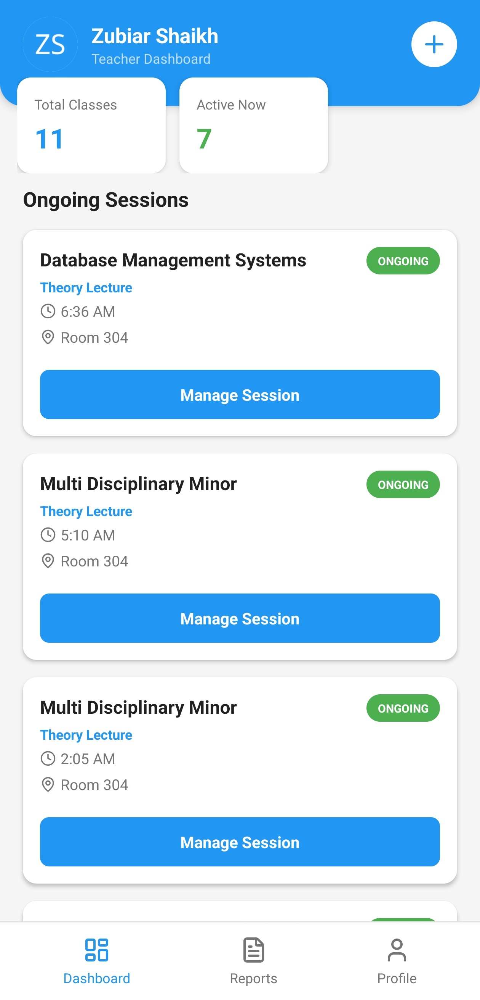
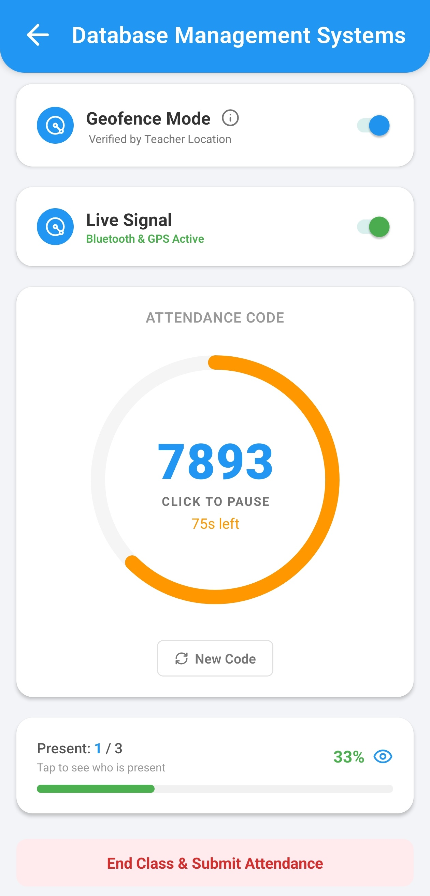
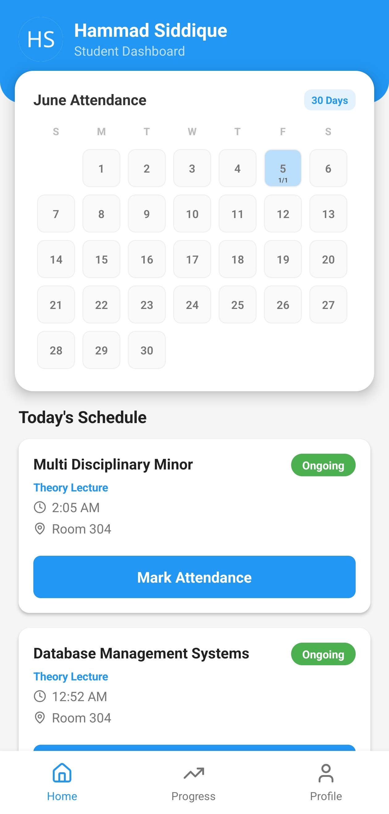
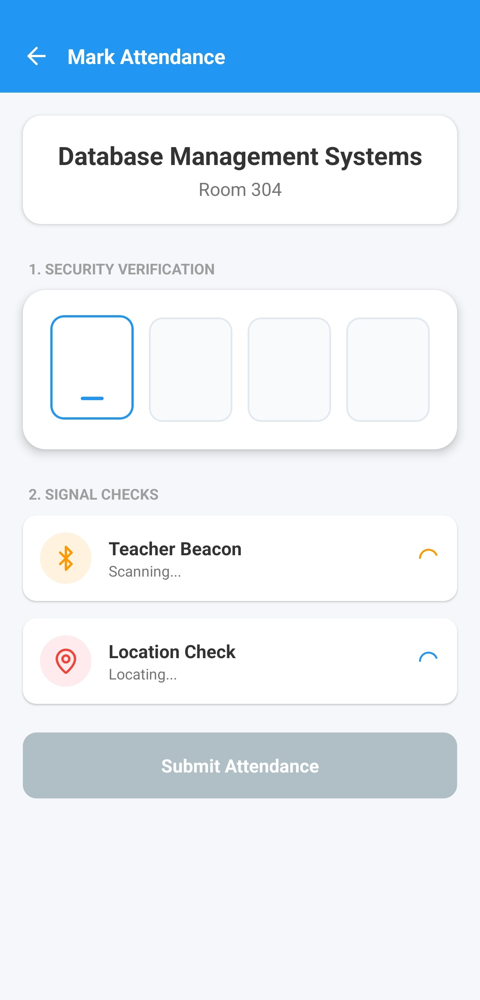

<div align="center">
  
  <h1>Adsum</h1>
</div>

## About The Project
Adsum is a Bring Your Own Device (BYOD) educational ERP and attendance system designed to eliminate the inefficiencies and security vulnerabilities of traditional roll calls. By leveraging the smartphones that students and faculty already carry, Adsum replaces expensive, dedicated biometric scanners with a highly secure, multi-layered software handshake. 

The system is built on a dynamic denominator architecture, allowing it to adapt to complex college scheduling environments involving multi-branch courses, practical batches, and ad-hoc lecture changes.

## Key Features

### Multi-Layered Security Protocol
Adsum ensures physical presence through four concurrent verification layers:
* **Proximity (BLE):** The faculty device acts as a local beacon, broadcasting a dynamically generated, session-specific payload. Student devices must intercept this specific signal to prove they are in the correct room.
* **Location (GPS Geofencing):** Verifies the student is strictly within a defined radius of the static classroom coordinates.
* **Time (Rolling TOTP):** A 4-digit OTP rotates every 45 seconds on the teacher's dashboard, nullifying distance-based code sharing.
* **Hardware ID Binding:** At registration, the system captures and binds the student's primary device ID to their profile. If a different device is used, the system flags the transaction for manual review.

### Role-Aware ERP Architecture
* **Faculty Isolation:** Dashboards are populated using relational bridge tables. Teachers only manage sessions for subjects explicitly assigned to them, preventing accidental cross-department scheduling.
* **Cohort Filtering:** Theory lectures broadcast to the entire class, while lab practicals enforce strict batch-level routing (e.g., Batch A only), ensuring students only see relevant active sessions.

### Advanced Academic Analytics
* **Mathematical Attendance Grid:** A custom, responsive contribution graph visualizes attendance density. Dark blue indicates perfect attendance for the day, light blue indicates partial attendance, and red highlights completely missed classes.
* **Server-Side Computation:** Complex subject-wise attendance percentages and dynamic denominator scaling are offloaded to PostgreSQL Remote Procedure Calls (RPCs), optimizing client-side performance.

## Built With
* React Native (CLI)
* Supabase (PostgreSQL, Auth, Realtime)
* react-native-ble-advertiser
* react-native-geolocation-service
* react-native-device-info
* react-native-svg

## Live Demo & Download
You can download the compiled Android APK directly to test the application on your physical device.
* [Download Adsum APK (Google Drive)](https://drive.google.com/file/d/1_qgk-JLDqkvDfPvA7y5XchN22DWq2aFh/view?usp=drive_link) 

A video demonstration showcasing the Bluetooth and GPS handshake architecture in real-time is available below.
* [Watch the Handshake Demo](https://youtu.be/9jhZFR0rttk)

## Screenshots
<div align="center">
  
  
  
  
</div>

## Getting Started
To get a local copy up and running on your PC, follow these simple steps.

### Prerequisites
You will need the standard React Native CLI development environment setup for Android.
* Node.js
* Android Studio (with an Android Emulator running API 33 or 34)
* Java Development Kit (JDK)

### Installation
1. Clone the repo
   ```bash
   git clone [https://github.com/hammad-dc/Adsum](https://github.com/hammad-dc/Adsum)

    ```

2. Install NPM packages
    ```bash
    npm install

    ```

3. Set up your environment variables
Create a `.env` file in the root directory and add your Supabase keys:
    ```text
    SUPABASE_URL=your_supabase_project_url
    SUPABASE_ANON_KEY=your_supabase_publishable_key

    ```

4. Start the Metro Bundler (Clear cache for fresh environment variables)
    ```bash
    npm start -- --reset-cache

    ```

5. Build and run the app on your emulator or connected device
    ```bash
    npx react-native run-android

    ```

#### iOS Build Note: This project utilizes custom native modules for BLE and Geofencing. To run on iOS, you must build from source using Xcode and Cocoapods on a macOS environment.
